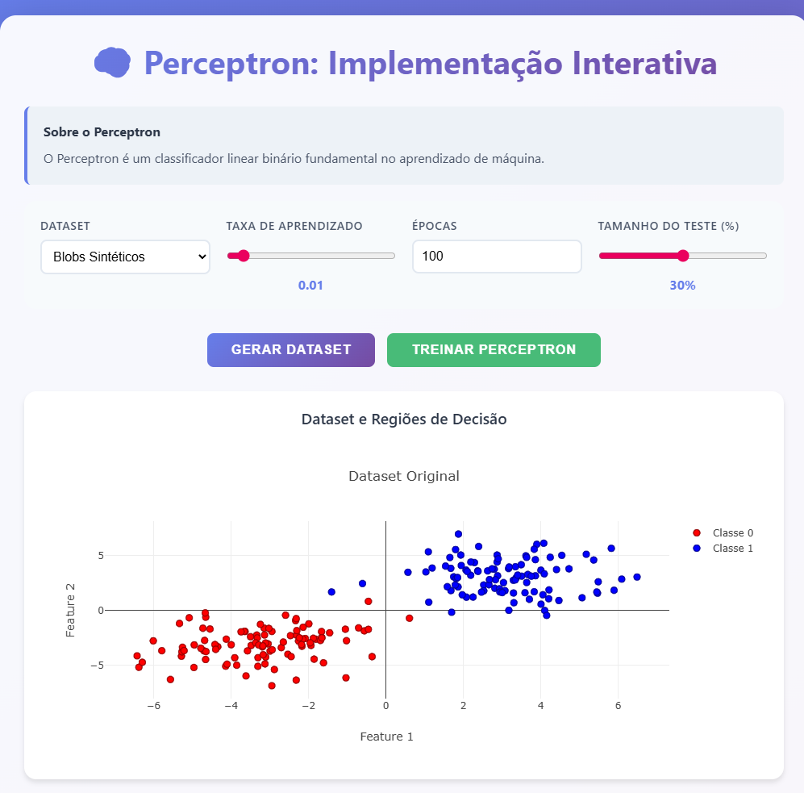

# 🧠 Perceptron Interativo - Implementação Visual

Uma implementação interativa e educacional do algoritmo Perceptron com visualizações em tempo real e múltiplos datasets clássicos de Machine Learning.



## 🎯 Características

- **6 Datasets Clássicos**: Blobs, Iris, Moons, Breast Cancer, Noisy Classification, e Custom
- **Visualização em Tempo Real**: Regiões de decisão, convergência e matriz de confusão
- **Interface Intuitiva**: Controles interativos para todos os hiperparâmetros
- **Análise Completa**: Métricas detalhadas incluindo precisão, recall e F1-score
- **100% Client-Side**: Não requer servidor, funciona direto no navegador

## 🚀 Demo Online

[Acesse a demo ao vivo aqui](https://brunarcedro.github.io/perceptron-interactive)

## 📋 Pré-requisitos

- Navegador moderno (Chrome, Firefox, Safari, Edge)
- Conexão com internet (para carregar Plotly.js do CDN)

## 🔧 Instalação

### Método 1: Clone o Repositório

```bash
git clone https://github.com/brunarcedro/perceptron-interactive.git
cd perceptron-interactive
```

### Método 2: Download ZIP

1. Faça o download do repositório como ZIP
2. Extraia os arquivos
3. Abra `index.html` no navegador

### Método 3: Servidor Local (Opcional)

Se preferir usar um servidor local:

```bash
# Com Python 3
python -m http.server 8000

# Com Node.js
npx http-server

# Com PHP
php -S localhost:8000
```

## 📚 Como Usar

### Interface Principal

1. **Selecione um Dataset**: Escolha entre os 6 datasets disponíveis
2. **Configure os Parâmetros**:
   - Taxa de Aprendizado (0.001 - 1.0)
   - Número de Épocas (1 - 500)
   - Tamanho do Teste (10% - 50%)
3. **Gere o Dataset**: Clique em "Gerar Dataset"
4. **Treine o Modelo**: Clique em "Treinar Perceptron"
5. **Analise os Resultados**: Explore as visualizações e métricas

### Datasets Disponíveis

| Dataset | Linearmente Separável | Descrição |
|---------|----------------------|-----------|
| **Blobs Sintéticos** | ✅ Sim | Dois clusters gaussianos bem separados |
| **Iris** | ✅ Sim | Classificação Setosa vs Versicolor |
| **Moons** | ❌ Não | Duas luas entrelaçadas (demonstra limitações) |
| **Breast Cancer** | ✅ Sim | Classificação de tumores (simplificado) |
| **Noisy Classification** | ✅ Parcialmente | Dataset com ruído controlável |
| **Custom** | ✅ Sim | Dois grupos personalizáveis |

## 🧪 Experimentos Sugeridos

### Experimento 1: Taxa de Aprendizado
```
1. Selecione "Blobs Sintéticos"
2. Teste com learning_rate = 0.001 (lento mas estável)
3. Teste com learning_rate = 1.0 (rápido mas pode oscilar)
4. Compare o número de épocas até convergência
```

### Experimento 2: Limitações do Perceptron
```
1. Selecione "Moons Dataset"
2. Observe que a acurácia fica em ~50-60%
3. Note que a linha reta não consegue separar as luas
4. Isto demonstra a limitação para dados não-lineares
```

### Experimento 3: Impacto do Ruído
```
1. Selecione "Moons" ou "Noisy Classification"
2. Ajuste o nível de ruído/separação
3. Observe como a performance degrada
4. Analise a robustez do algoritmo
```

## 📊 Métricas Disponíveis

- **Acurácia**: Taxa de acertos geral
- **Precisão**: VP / (VP + FP)
- **Recall**: VP / (VP + FN)
- **F1-Score**: Média harmônica de precisão e recall
- **Matriz de Confusão**: Visualização de VP, VN, FP, FN
- **Convergência**: Época em que o erro chegou a zero

## 🏗️ Estrutura do Projeto

```
perceptron-interactive/
│
├── index.html           # Página principal
├── css/
│   └── style.css       # Estilos e animações
├── js/
│   ├── perceptron.js   # Implementação do algoritmo
│   ├── datasets.js     # Geradores de datasets
│   ├── visualization.js # Funções de plotagem
│   └── main.js         # Lógica da aplicação
├── docs/
│   ├── tutorial.md     # Tutorial completo
└── README.md           # Este arquivo
```

## 🔬 Detalhes Técnicos

### Algoritmo Perceptron

```javascript
// Regra de atualização
w = w + η * (y_real - y_pred) * x
bias = bias + η * (y_real - y_pred)

// Função de ativação (step function)
f(x) = 1 se x >= 0, 0 caso contrário

// Condição de parada
Converge quando todos os exemplos são classificados corretamente
```

### Normalização

Todos os dados são normalizados usando z-score:
```javascript
x_norm = (x - média) / desvio_padrão
```

## 📈 Performance

- **Tempo de Treinamento**: < 100ms para 200 amostras
- **Memória**: < 10MB incluindo visualizações
- **Compatibilidade**: Funciona em todos navegadores modernos

## 🤝 Contribuindo

Contribuições são bem-vindas! Para contribuir:

1. Fork o projeto
2. Crie uma branch (`git checkout -b feature/NovaFeature`)
3. Commit suas mudanças (`git commit -am 'Add NovaFeature'`)
4. Push para a branch (`git push origin feature/NovaFeature`)
5. Abra um Pull Request

### Ideias para Contribuições

- [ ] Adicionar mais datasets
- [ ] Implementar outros algoritmos (Adaline, MLP)
- [ ] Adicionar exportação de modelos
- [ ] Criar testes automatizados
- [ ] Melhorar responsividade mobile
- [ ] Adicionar mais idiomas

## 🙏 Agradecimentos

- Frank Rosenblatt pelo algoritmo Perceptron (1957)
- [Plotly.js](https://plotly.com/) pela biblioteca de visualização
- Comunidade de Machine Learning pelos datasets clássicos

## 📚 Referências

- Rosenblatt, F. (1958). "The perceptron: A probabilistic model for information storage and organization in the brain"
- Bishop, C. M. (2006). "Pattern Recognition and Machine Learning"
- [Scikit-learn Datasets](https://scikit-learn.org/stable/datasets.html)

## 📧 Contato

Bruna Cedro - bruna@underlinetech.com.br

Link do Projeto: [https://github.com/brunarcedro/perceptron-interactive](https://github.com/brunarcedro/perceptron-interactive)

---

⭐ Se este projeto te ajudou, considere dar uma estrela no GitHub!